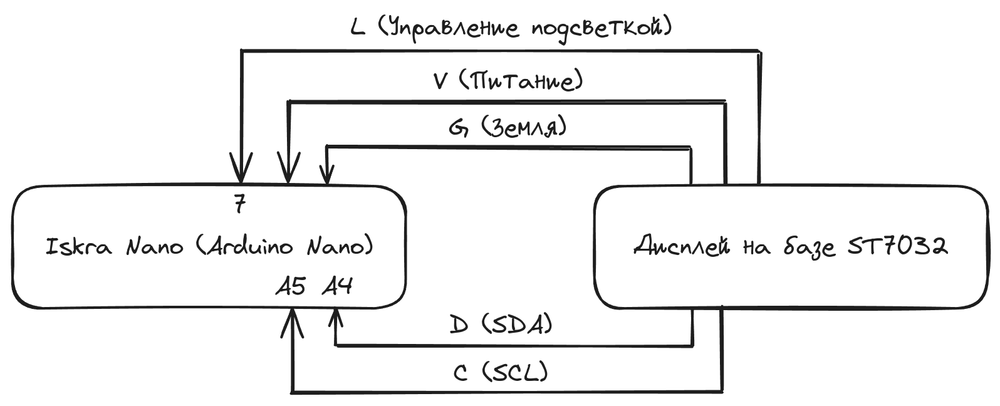
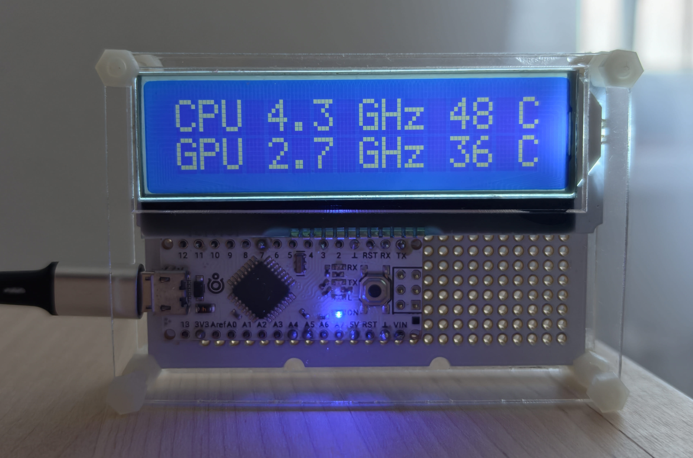

# PC Monitor

Проект устройства для отображения нагрузки и температур компонентов ПК на LCD-дисплее через Arduino.

## Сборка



## Требования

- Arduino-совместимая плата (Iskra Nano / Arduino Nano) с прошивкой из `./ino/pc_monitor.ino`
- LibreHardwareMonitor с запущенным веб-сервером
- Файлы `template.txt` и `config.json` рядом с исполняемым файлом

## Запуск готового приложения

1. Скачать `resource-display.exe` из релиза
2. Создать файл `template.txt` с шаблоном отображения (пример в `template.txt.example`)
3. Создать `config.json` с настройками
4. Запустить `./resource-display.exe`

## Установка зависимостей и запуск из исходников

```bash
git clone https://github.com/outsid3rx/pc-monitor.git
cd pc-monitor
pnpm install
pnpm run build
pnpm run start
```

## Сборка исполняемого файла

Перед первой сборкой установить @yao-pkg/pkg:

```bash
pnpm install -D @yao-pkg/pkg
```

Сборка:

```bash
pnpm run pack
```

Результат: `./bin/resource-display.exe`

Для сборки требуется Node.js 24.

## Настройка LibreHardwareMonitor

1. Запустить LibreHardwareMonitor
2. Settings (шестерёнка) → Web Server → включить Enable
3. По умолчанию порт 8085
4. Скопировать адрес (`http://127.0.0.1:8085/data.json`) в config.json

## Настройка config.json

```json
{
  "hwinfoUrl": "http://127.0.0.1:8085/data.json",
  "gpuModel": "NVIDIA GeForce RTX 5080"
}
```

| Параметр    | Описание                                         | По умолчанию                          |
|-------------|--------------------------------------------------|---------------------------------------|
| hwinfoUrl   | URL веб-сервера LibreHardwareMonitor             | http://127.0.0.1:8085/data.json       |
| gpuModel    | Название видеокарты для отображения (опционально)| первая доступная видеокарта           |

## Настройка шаблонов

В файле `template.txt` описывается отображение информации. Специальные токены заменяются на значения:

| Токен    | Описание                                                                  |
|----------|---------------------------------------------------------------------------|
| %C-Ghz%  | Частота процессора в Гигагерцах                                           |
| %C-Temp% | Температура процессора в градусах Цельсия                                 |
| %C-Load% | Загрузка процессора в процентах                                           |
| %G-Ghz%  | Частота видеоадаптера в Гигагерцах                                        |
| %G-Temp% | Температура видеоадаптера в градусах Цельсия                              |
| %G-Load% | Загрузка видеоадаптера в процентах                                        |
| %R-Used% | Загруженность ОЗУ в процентах                                             |

Пример шаблона:

```
C:%C-Ghz% %C-Temp%° %C-Load%
G:%G-Ghz% %G-Temp%° %G-Load%
R:%R-Used%
```

## Готовый вариант


